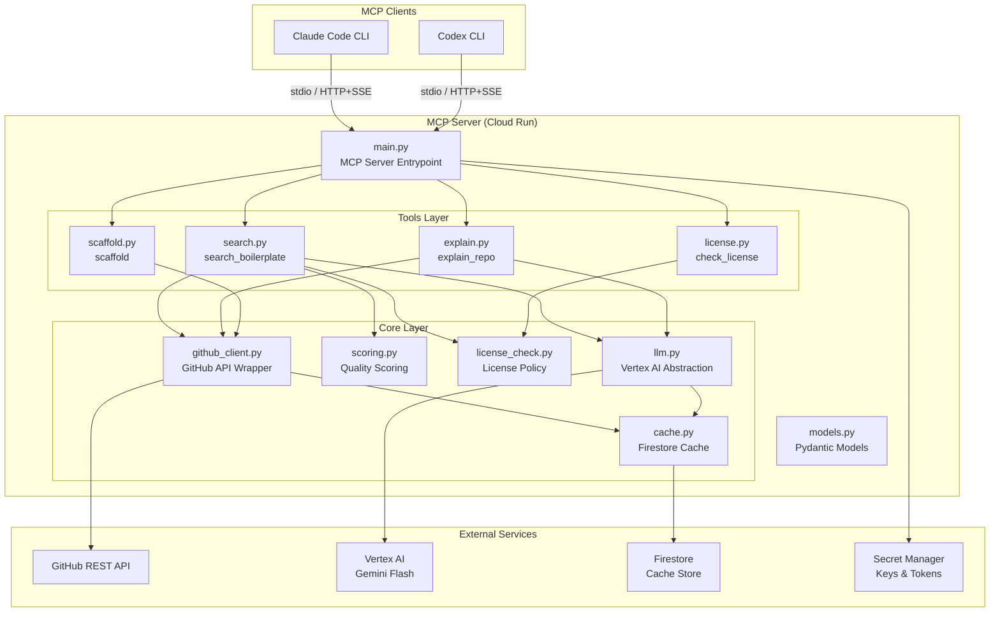
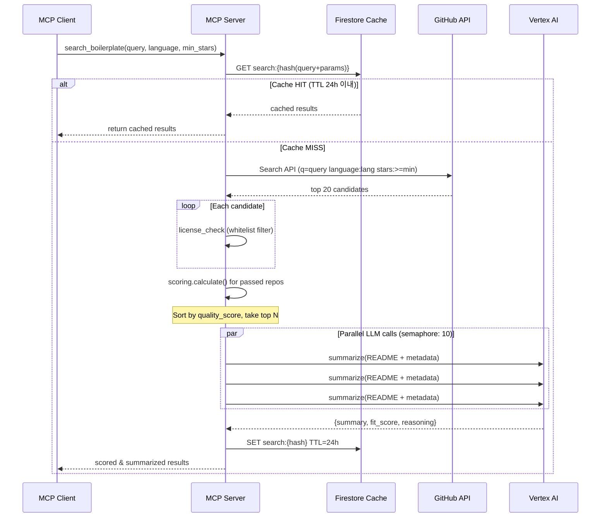
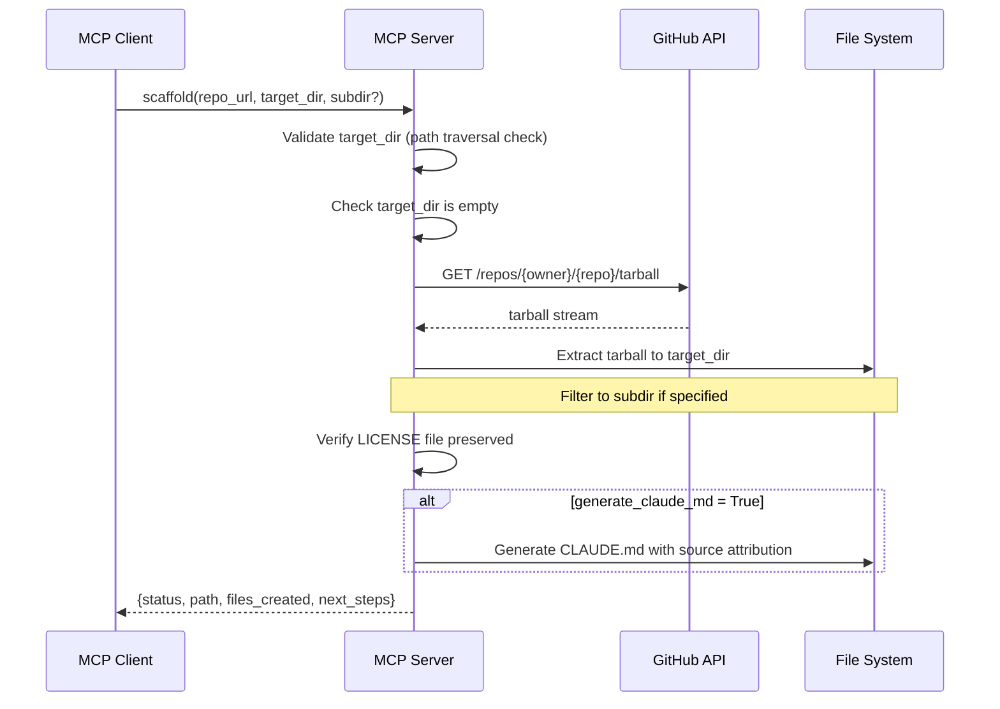
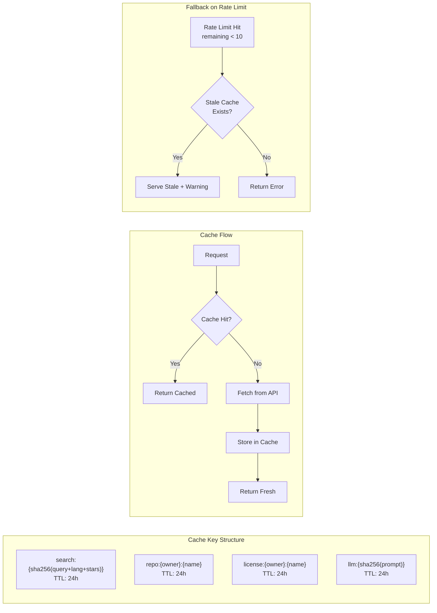
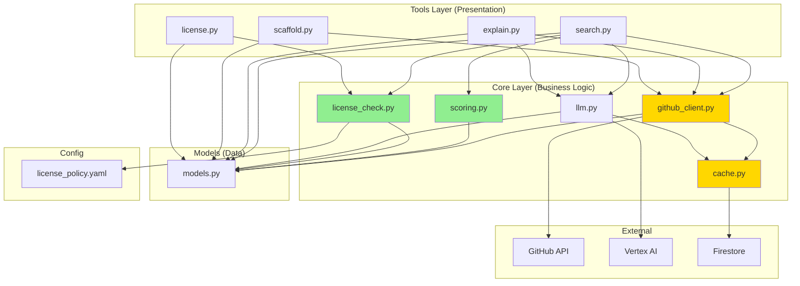
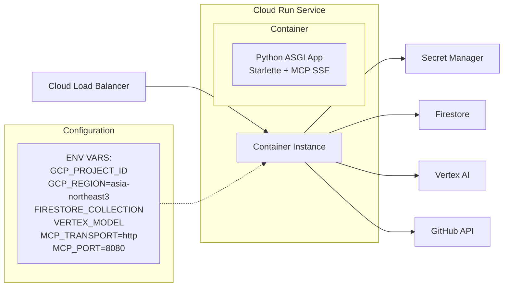
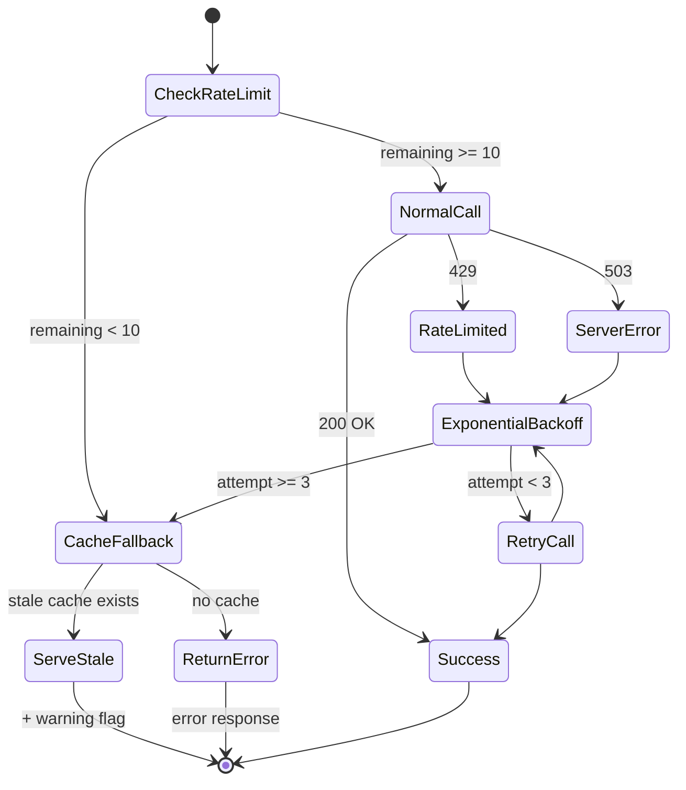

# OSS Scout MCP Server — 시스템 아키텍처 & 기술 설계서

## 1. 시스템 아키텍처 개요

### 1.1 전체 시스템 구성도



### 1.2 데이터 플로우: search_boilerplate



### 1.3 데이터 플로우: scaffold



### 1.4 캐시 전략 다이어그램



---

## 2. 모듈별 책임과 의존관계

### 2.1 Tools Layer (server/tools/)

| 모듈 | 책임 | 의존하는 Core 모듈 |
|------|------|---------------------|
| `search.py` | 자연어 쿼리 → GitHub 검색 → 필터링 → 스코어링 → LLM 요약 → 결과 반환 | github_client, scoring, license_check, llm, cache |
| `explain.py` | 특정 레포의 구조/용도/주의점 요약 생성 | github_client, llm |
| `scaffold.py` | 레포 tarball 다운로드 → 압축 해제 → CLAUDE.md 생성 | github_client |
| `license.py` | 단독 라이선스 판정 (다른 툴에서도 재사용) | license_check |

### 2.2 Core Layer (server/core/)

| 모듈 | 책임 | 외부 의존성 |
|------|------|-------------|
| `github_client.py` | GitHub API 래퍼. Rate limit 추적, 캐시 경유, 재시도, 병렬 호출 관리 | PyGithub, cache.py |
| `scoring.py` | 품질 스코어 계산 (activity, popularity, maturity, documentation) | 없음 (순수 계산) |
| `license_check.py` | 라이선스 화이트리스트/블랙리스트 판정. GitHub API 필드 + LICENSE 파일 교차 검증 | license_policy.yaml |
| `llm.py` | Vertex AI Gemini 요약 추상화. 프롬프트 관리, JSON 파싱, 폴백 | Vertex AI SDK, cache.py |
| `cache.py` | Firestore 캐시 CRUD. TTL 관리, 키 해싱 | google-cloud-firestore |

### 2.3 의존성 방향 다이어그램



**설계 원칙**: 의존성은 항상 Tools → Core → External 방향. Core 모듈 간 순환 의존 없음. `scoring.py`는 순수 함수 모듈(외부 의존성 없음)로 테스트가 가장 쉬움.

---

## 3. 기술 스택 상세 설계

### 3.1 Python 3.11+ 비동기 아키텍처

```
asyncio Event Loop
├── MCP Server (main.py)
│   ├── Tool Handler: search_boilerplate
│   │   ├── await github_client.search()
│   │   ├── await license_check.check_batch()
│   │   ├── scoring.calculate()  ← sync (CPU-bound, pure computation)
│   │   └── await asyncio.gather(*[llm.summarize(r) for r in repos])
│   ├── Tool Handler: explain_repo
│   ├── Tool Handler: scaffold
│   └── Tool Handler: check_license
└── Semaphore(10) for concurrent external API calls
```

- 모든 I/O 바운드 작업(GitHub API, Vertex AI, Firestore)은 `async/await`
- CPU 바운드 작업(`scoring.calculate()`)은 동기 함수로 유지 (계산량 적음)
- `asyncio.Semaphore(10)`으로 동시 외부 API 호출 제한

### 3.2 MCP Python SDK 통합

```python
# main.py 구조 (개념)
from mcp.server import Server
from mcp.server.stdio import stdio_server
from mcp.server.sse import SseServerTransport

app = Server("oss-scout")

# 두 가지 전송 모드 지원
if MCP_TRANSPORT == "stdio":
    # Claude Code 로컬 연동
    async with stdio_server() as (read, write):
        await app.run(read, write, app.create_initialization_options())
elif MCP_TRANSPORT == "http":
    # Cloud Run 배포용 HTTP/SSE
    # Starlette + SseServerTransport
```

**전송 모드**:
- `stdio`: 로컬 개발 및 `claude mcp add` 직접 연동
- `http` (SSE): Cloud Run 배포 시 사용. Starlette ASGI 앱으로 래핑

### 3.3 Cloud Run 배포 아키텍처



- **리전**: `asia-northeast3` (서울) — Artience GCP 스택과 일치
- **인스턴스 설정**: 최소 0, 최대 5 (자동 스케일링, 비용 보수적)
- **메모리**: 512MB (LLM 호출은 외부이므로 서버 자체 메모리 낮음)
- **타임아웃**: 300초 (MCP 30초 타임아웃은 클라이언트 측이나, Cloud Run은 넉넉하게)
- **시크릿**: Secret Manager에서 `GITHUB_TOKEN` 마운트

### 3.4 Firestore 컬렉션 설계

**컬렉션**: `oss_scout_cache` (단일 컬렉션, 키 프리픽스로 구분)

| 문서 ID 패턴 | 내용 | TTL | 예시 |
|---------------|------|-----|------|
| `search:{sha256(query+lang+stars+copyleft)}` | 검색 결과 리스트 | 24h | `search:a3f2b1...` |
| `repo:{owner}:{name}` | 레포 메타데이터 (stars, commits, etc.) | 24h | `repo:vercel:next.js` |
| `license:{owner}:{name}` | 라이선스 판정 결과 | 24h | `license:vercel:next.js` |
| `llm:{sha256(prompt_hash)}` | LLM 요약 결과 | 24h | `llm:c7d9e2...` |

**문서 구조**:
```json
{
  "key": "search:a3f2b1...",
  "data": { ... },
  "created_at": "2026-04-13T10:00:00Z",
  "ttl_expires": "2026-04-14T10:00:00Z",
  "version": 1
}
```

**TTL 전략**:
- 모든 캐시 TTL은 24h로 통일 (ossmaker.md 스펙 기준)
- TTL 만료 확인은 읽기 시 `ttl_expires` 필드 비교 (Firestore TTL 자동 삭제 정책도 병행 설정 가능)

---

## 4. 품질 스코어링 엔진 설계

### 4.1 스코어 구성

```mermaid
graph TD
    QS[quality_score<br/>0.0 ~ 1.0]
    
    AS[activity_score<br/>weight: 0.40]
    PS[popularity_score<br/>weight: 0.25]
    MS[maturity_score<br/>weight: 0.20]
    DS[documentation_score<br/>weight: 0.15]
    
    QS --> AS & PS & MS & DS
    
    AS --> C6[commits_last_6mo<br/>min(n/50, 1.0) x 0.7]
    AS --> RF[recency_factor<br/>max(0, 1 - days/180) x 0.3]
    
    PS --> STARS[log10(stars+1) / 5<br/>clamp 0~1]
    
    MS --> HT[has_tests x 0.4]
    MS --> HC[has_ci x 0.3]
    MS --> HR[has_releases x 0.3]
    
    DS --> RL[readme_len_score x 0.5]
    DS --> HE[has_examples x 0.3]
    DS --> HL[has_license x 0.2]
    
    PENALTY[archived? x 0.3 penalty]
    QS -.-> PENALTY
```

### 4.2 계산 로직 상세

**activity_score** (가중치 40%):
```
commit_factor = min(commits_last_6mo / 50, 1.0)
recency_factor = max(0, 1 - days_since_last_commit / 180)
activity_score = commit_factor * 0.7 + recency_factor * 0.3
```
- 6개월간 50개 이상 커밋이면 만점
- 마지막 커밋이 180일(6개월) 이상이면 recency = 0

**popularity_score** (가중치 25%):
```
popularity_score = clamp(log10(stars + 1) / 5, 0, 1)
```
- 100,000 stars = log10(100001)/5 ~ 1.0
- 1,000 stars ~ 0.60
- 100 stars ~ 0.40

**maturity_score** (가중치 20%):
```
maturity_score = has_tests * 0.4 + has_ci * 0.3 + has_releases * 0.3
```
- `has_tests`: 테스트 디렉토리/파일 존재 여부 (boolean -> 0 or 1)
- `has_ci`: `.github/workflows/`, `.circleci/`, `Jenkinsfile` 등 존재 여부
- `has_releases`: GitHub releases 또는 태그 존재 여부

**documentation_score** (가중치 15%):
```
readme_len_score = clamp(len(readme) / 5000, 0, 1)
documentation_score = readme_len_score * 0.5 + has_examples * 0.3 + has_license * 0.2
```
- README 5000자 이상이면 만점
- `has_examples`: `examples/`, `demo/` 디렉토리 존재 여부
- `has_license`: LICENSE 파일 존재 여부

**아카이브 페널티**:
```
if repo.archived:
    quality_score *= 0.3
```

### 4.3 정규화 전략

- 모든 하위 점수는 0.0~1.0 범위로 정규화
- `clamp(value, 0, 1)` 함수로 범위 초과 방지
- 로그 스케일(`log10`)을 사용하여 극단값(10만 stars) 영향 완화
- 최종 quality_score도 0.0~1.0 범위 (가중합이므로 자동 보장)

---

## 5. 에러 처리 & 복원력 설계

### 5.1 Rate Limit 대응 전략



**구체적 동작**:
1. 매 API 호출 전 `X-RateLimit-Remaining` 헤더 확인
2. 남은 호출 < 10이면 API 호출 건너뛰고 캐시 폴백
3. 캐시에 stale 데이터라도 있으면 warning과 함께 반환
4. 캐시도 없으면 한국어 에러 메시지 반환

### 5.2 재시도 정책 (지수 백오프)

| 시도 | 대기 시간 | 대상 HTTP 코드 |
|------|-----------|----------------|
| 1차 | 1초 | 429, 503 |
| 2차 | 2초 | 429, 503 |
| 3차 | 4초 | 429, 503 |
| 최종 | 캐시 폴백 또는 에러 | - |

- 최대 3회 재시도
- 429(Rate Limit)와 503(Server Error)에만 재시도
- 4xx (429 제외), 5xx (503 제외)는 즉시 실패
- 지터(jitter): 각 대기 시간에 0~0.5초 랜덤 추가로 thundering herd 방지

### 5.3 타임아웃 전략

MCP 클라이언트(Claude Code)는 30초 타임아웃이 있으므로:

| 단계 | 타임아웃 | 설명 |
|------|----------|------|
| GitHub Search API | 10초 | 단일 검색 요청 |
| GitHub Repo API | 5초 | 개별 레포 메타데이터 |
| Vertex AI 요약 | 15초 | LLM 호출 (가장 느림) |
| Firestore 캐시 | 3초 | 캐시 읽기/쓰기 |
| **전체 search_boilerplate** | **25초** | **클라이언트 30초 내 응답 보장** |

- 전체 파이프라인에 25초 하드 타임아웃 (`asyncio.wait_for`)
- LLM 요약이 타임아웃되면 요약 없이 결과 반환 (graceful degradation)
- 캐시 쓰기가 타임아웃되면 무시하고 응답 먼저 반환 (fire-and-forget)

### 5.4 LLM 실패 시 폴백

```
LLM Call
├── Success -> parse JSON {summary, fit_score, reasoning}
├── JSON Parse Error -> 1회 재시도 (프롬프트에 "JSON만 출력" 강조)
│   ├── Success -> use result
│   └── Fail -> fit_score=0.5, summary="요약 생성 실패"
├── Timeout (15s) -> fit_score=0.5, summary=repo.description (GitHub 기본 설명)
├── Vertex AI Error -> Claude Haiku 폴백 시도
│   ├── Success -> use result
│   └── Fail -> fit_score=0.5, summary=repo.description
└── Rate Limit -> fit_score=0.5, summary=repo.description
```

핵심 원칙: **LLM 실패가 전체 검색 결과를 차단하지 않음**. 요약은 선택적 부가 정보.

---

## 6. 확장성 고려사항

### 6.1 동시 요청 처리

```python
# 세마포어로 동시 외부 API 호출 제한
GITHUB_SEMAPHORE = asyncio.Semaphore(10)
VERTEX_SEMAPHORE = asyncio.Semaphore(5)

async def github_call(endpoint):
    async with GITHUB_SEMAPHORE:
        return await _do_github_call(endpoint)

async def vertex_call(prompt):
    async with VERTEX_SEMAPHORE:
        return await _do_vertex_call(prompt)
```

- GitHub API: 동시 10개 (인증된 사용자 rate limit: 5000/h)
- Vertex AI: 동시 5개 (비용 제어 + API quota 보호)
- Cloud Run 인스턴스당 동시 요청 수: 기본 80으로 설정

### 6.2 캐시 무효화 전략

| 전략 | 적용 대상 | 방법 |
|------|-----------|------|
| TTL 기반 자동 만료 | 모든 캐시 | `ttl_expires` 필드 확인 + Firestore TTL 정책 |
| 수동 무효화 | 특정 레포 | 향후 admin 도구에서 `repo:{owner}:{name}` 삭제 |
| 버전 키 | 스코어링 로직 변경 시 | 캐시 키에 `v{version}` 프리픽스 추가 |

모든 캐시 TTL은 24h로 통일. ossmaker.md 스펙 기준을 따른다.

### 6.3 향후 확장 가능성

| 확장 방향 | 설계적 대비 | 필요 작업 |
|-----------|-------------|-----------|
| **새로운 MCP 툴 추가** | Tools Layer가 Core Layer와 분리됨. 새 툴은 기존 core 모듈 조합으로 구성 | `tools/` 디렉토리에 새 파일 추가, `main.py`에 등록 |
| **다른 코드 호스팅 지원 (GitLab 등)** | `github_client.py`를 인터페이스로 추상화 가능 | `core/source_client.py` 인터페이스 정의, 구현체 분리 |
| **다른 LLM 백엔드** | `llm.py`가 이미 Gemini + Claude Haiku 폴백 구조 | 새 백엔드 추가는 `llm.py` 내 분기 추가 |
| **Redis 캐시 전환** | `cache.py`가 추상 레이어 역할 | `cache.py` 내부 구현만 교체 |
| **프라이빗 레포 지원** | 현재 out of scope이나, 인증 토큰 분리 설계 | Token 스코프 확장 + 권한 검증 로직 추가 |
| **검색 필터 확장** | Pydantic 모델 기반 입력 검증 | `models.py`에 필드 추가, `search.py` 쿼리 빌딩 확장 |

---

## 7. 보안 설계

### 7.1 시크릿 관리

- 모든 시크릿은 GCP Secret Manager에서 런타임 로드
- 환경 변수 `GITHUB_TOKEN`은 Secret Manager에서 마운트 (Cloud Run 네이티브 통합)
- `.env` 파일은 로컬 개발용이며 `.gitignore`에 포함
- API 키 하드코딩 금지 (lint rule로 강제)

### 7.2 Path Traversal 방지 (scaffold)

```python
def validate_target_dir(target_dir: str, cwd: str) -> str:
    resolved = Path(target_dir).resolve()
    cwd_resolved = Path(cwd).resolve()
    if not resolved.is_relative_to(cwd_resolved):  # Python 3.9+
        raise SecurityError("target_dir must be under current working directory")
    return str(resolved)
```

### 7.3 Tarball 추출 보안 (scaffold)

tarball 추출 시 다음 보안 검증을 반드시 수행:

- **symlink 거부**: tarball 내 심볼릭 링크 추출 차단
- **절대 경로 거부**: 절대 경로를 가진 파일 엔트리 차단
- **path traversal 거부**: `..` 포함 경로 차단
- **파일 수 제한**: 최대 10,000개 (DoS 방지)
- **총 크기 제한**: 최대 100MB (리소스 소진 방지)
- **안전한 추출**: `tarfile.extractall(filter="data")` 사용 (Python 3.12+) 또는 수동 필터링

```python
import tarfile

def safe_extract(tar: tarfile.TarFile, dest: Path, max_files: int = 10_000, max_bytes: int = 100 * 1024 * 1024):
    total_size = 0
    file_count = 0
    for member in tar.getmembers():
        if member.issym() or member.islnk():
            raise SecurityError(f"Symlink not allowed: {member.name}")
        if member.name.startswith("/") or ".." in member.name:
            raise SecurityError(f"Path traversal not allowed: {member.name}")
        total_size += member.size
        file_count += 1
        if file_count > max_files:
            raise SecurityError(f"Too many files: > {max_files}")
        if total_size > max_bytes:
            raise SecurityError(f"Total size exceeds {max_bytes} bytes")
    tar.extractall(dest, filter="data")  # Python 3.12+ safe filter
```

### 7.4 입력 검증

- 모든 MCP 툴 입력은 Pydantic 모델로 검증
- `repo_url`은 `https://github.com/{owner}/{name}` 형식만 허용
- `query` 길이 제한 (최대 200자)
- `max_results` 범위 제한 (1~20)

---

## 8. 관찰성 (Observability)

### 8.1 로깅 전략

| 레벨 | 용도 | 언어 |
|------|------|------|
| ERROR | 복구 불가 에러 (시크릿 로드 실패 등) | 영어 (디버깅용) |
| WARNING | Rate limit 근접, 캐시 폴백, LLM 재시도 | 영어 |
| INFO | 툴 호출 시작/완료, 캐시 히트/미스 | 영어 |
| DEBUG | API 요청/응답 상세, 스코어 계산 과정 | 영어 |

- 사용자 대면 에러 메시지는 한국어
- 내부 로그는 영어 (GCP Cloud Logging 호환)
- 구조화 로깅 (JSON 형식) for Cloud Run
